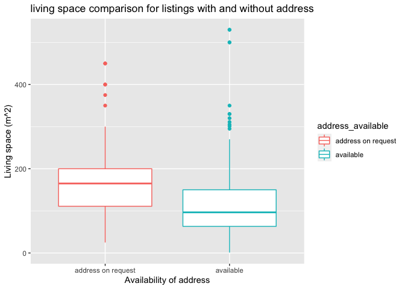
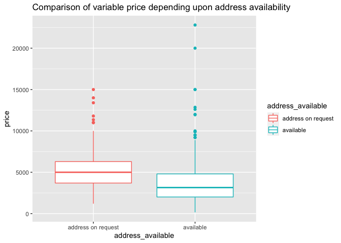

Project1
================

# Part 1

Get the full dataset out of the
site

``` r
rental_tibble<-bind_cols(location=location, price=as.numeric(price), currency=currency,
                         object_type=object_type,rooms=rooms, 
                         living_space=living_space, floor=floor, 
                         availability=availability, usable_surface=as.numeric(usable_surface))

rental_tibble <- rental_tibble %>% 
  mutate(floor=as.numeric(stringr::str_replace(rental_tibble$floor,"Underground","-1")))
```

# Part 2

Scatterplot showing how price evolves with living space of the flat.

``` r
price_living_space<-rental_tibble %>% 
                    select(price, living_space) %>% 
                    dplyr::filter(complete.cases(.)) %>% 
                    tidyr::drop_na(living_space) %>% 
                    #mutate(living_space=as.numeric(stringr::str_sub(living_space,start=1L, end=-3L)))
                    mutate(living_space=as.numeric(stringr::str_extract(living_space, "\\d+")))

# str_extract(living_space, "\\d+")   

price_living_space %>%  ggplot2::ggplot(aes(x=price, y=living_space)) + 
              geom_point() +
              labs (title = "Comparison of price vs living space",
                                 caption = "Source: Rental scrap website",
                                 x = "Price of the rental space",
                                 y = "Living space (m^2)")
```

<!-- -->

``` r
maximum_price<-rental_tibble %>% 
  select(price) %>% 
  filter(price==max(price, na.rm=TRUE)) %>% 
  as.numeric()
```

In the above scatter plot, there is a linear relationship between the
two variables.

The maximum price observed for the rooms is 22800.

# Part 3

A bar plot showing the number of properties by postcode.

``` r
properties_postcode<-rental_tibble %>% 
                     select(location) %>% 
                     mutate(location=stringr::str_extract(rental_tibble$location, "\\d{4}")) %>% 
                     group_by(location) %>% 
                     count() 

properties_postcode %>% ggplot2::ggplot(aes(y=as.character(location), x=n)) + 
  geom_bar(stat="identity") +
             theme(legend.position="right", legend.box = "horizontal")+
              labs (title = "Number of properties by postcode",
                                 subtitle = "Using colors to differentiate postcodes",
                                 caption = "Source: Rental scrap website",
                                 x = "Number of properties",
                                 y = "Postcode")
```

<!-- -->

``` r
active_areas<-properties_postcode %>%
  arrange(desc(n)) %>% 
  ungroup() %>% 
  top_n(5)

active_areas%>%
  knitr::kable(caption = "Top five postcode with most number of rooms") %>% 
  kableExtra::kable_styling(bootstrap_options = "striped", full_width = F, position = "left")
```

| location |  n |
| :------- | -: |
| 1206     | 57 |
| 1205     | 46 |
| 1208     | 33 |
| 1207     | 32 |
| 1201     | 30 |
| 1202     | 30 |

Top five postcode with most number of rooms

# Part 4

Price evolution with living space of the flat by postcode and by floor

``` r
price_living_space_postcode<-rental_tibble %>% 
                    select(price, living_space, floor,location) %>% 
                    mutate(living_space=as.numeric(stringr::str_sub(living_space,start=1L, end=-3L))) %>% 
                    mutate(postcode=stringr::str_extract(rental_tibble$location, "\\d{4}")) %>% 
                    select(-location) %>% 
                    dplyr::filter(complete.cases(.)) %>% 
                    tidyr::drop_na(floor) %>%  
                    na.omit() %>% 
                    group_by(floor)  
                    

price_living_space_postcode %>% ggplot(mapping=aes(x=living_space, y= price, fill=postcode)) +
geom_point(aes(group=postcode, color=postcode)) + facet_wrap(vars(floor)) +
             theme(legend.position="none")+
              labs (title = "Comparison of price over living space for nth floor",
                                 subtitle = "Using colors to differentiate postcode and facet grid for the number of floor",
                                 caption = "Source: Rental scrape data",
                                 x = "Living surface in m2",
                                 y = "Price")
```

<!-- -->

``` r
Most_expensive_postcode_floor<-price_living_space_postcode %>% 
                               select(price, postcode, floor) %>% 
                               group_by(floor) %>% 
                               slice(which.max(price))

Table_most_expensive_by_floor<-knitr::kable(Most_expensive_postcode_floor, caption = "Table with kable")
Table_most_expensive_by_floor
```

<table>

<caption>

Table with kable

</caption>

<thead>

<tr>

<th style="text-align:right;">

price

</th>

<th style="text-align:left;">

postcode

</th>

<th style="text-align:right;">

floor

</th>

</tr>

</thead>

<tbody>

<tr>

<td style="text-align:right;">

440

</td>

<td style="text-align:left;">

1218

</td>

<td style="text-align:right;">

\-1

</td>

</tr>

<tr>

<td style="text-align:right;">

9570

</td>

<td style="text-align:left;">

1204

</td>

<td style="text-align:right;">

1

</td>

</tr>

<tr>

<td style="text-align:right;">

12854

</td>

<td style="text-align:left;">

1292

</td>

<td style="text-align:right;">

2

</td>

</tr>

<tr>

<td style="text-align:right;">

15000

</td>

<td style="text-align:left;">

1201

</td>

<td style="text-align:right;">

3

</td>

</tr>

<tr>

<td style="text-align:right;">

8000

</td>

<td style="text-align:left;">

1209

</td>

<td style="text-align:right;">

4

</td>

</tr>

<tr>

<td style="text-align:right;">

11950

</td>

<td style="text-align:left;">

1206

</td>

<td style="text-align:right;">

5

</td>

</tr>

<tr>

<td style="text-align:right;">

7500

</td>

<td style="text-align:left;">

1201

</td>

<td style="text-align:right;">

6

</td>

</tr>

<tr>

<td style="text-align:right;">

5750

</td>

<td style="text-align:left;">

1202

</td>

<td style="text-align:right;">

7

</td>

</tr>

<tr>

<td style="text-align:right;">

13400

</td>

<td style="text-align:left;">

1206

</td>

<td style="text-align:right;">

8

</td>

</tr>

<tr>

<td style="text-align:right;">

6000

</td>

<td style="text-align:left;">

1209

</td>

<td style="text-align:right;">

9

</td>

</tr>

<tr>

<td style="text-align:right;">

5975

</td>

<td style="text-align:left;">

1213

</td>

<td style="text-align:right;">

10

</td>

</tr>

<tr>

<td style="text-align:right;">

5400

</td>

<td style="text-align:left;">

1209

</td>

<td style="text-align:right;">

11

</td>

</tr>

<tr>

<td style="text-align:right;">

2135

</td>

<td style="text-align:left;">

1203

</td>

<td style="text-align:right;">

12

</td>

</tr>

<tr>

<td style="text-align:right;">

1880

</td>

<td style="text-align:left;">

1219

</td>

<td style="text-align:right;">

18

</td>

</tr>

</tbody>

</table>

``` r
Least_expensive_postcode_floor<-price_living_space_postcode %>% 
                               select(price, postcode, floor) %>% 
                               group_by(floor) %>% 
                               slice(which.min(price))

Table_least_expensive_by_floor<-knitr::kable(Least_expensive_postcode_floor, caption = "Table with kable")
Table_least_expensive_by_floor
```

<table>

<caption>

Table with kable

</caption>

<thead>

<tr>

<th style="text-align:right;">

price

</th>

<th style="text-align:left;">

postcode

</th>

<th style="text-align:right;">

floor

</th>

</tr>

</thead>

<tbody>

<tr>

<td style="text-align:right;">

150

</td>

<td style="text-align:left;">

1218

</td>

<td style="text-align:right;">

\-1

</td>

</tr>

<tr>

<td style="text-align:right;">

900

</td>

<td style="text-align:left;">

1201

</td>

<td style="text-align:right;">

1

</td>

</tr>

<tr>

<td style="text-align:right;">

1050

</td>

<td style="text-align:left;">

1204

</td>

<td style="text-align:right;">

2

</td>

</tr>

<tr>

<td style="text-align:right;">

1315

</td>

<td style="text-align:left;">

1203

</td>

<td style="text-align:right;">

3

</td>

</tr>

<tr>

<td style="text-align:right;">

1250

</td>

<td style="text-align:left;">

1205

</td>

<td style="text-align:right;">

4

</td>

</tr>

<tr>

<td style="text-align:right;">

960

</td>

<td style="text-align:left;">

1202

</td>

<td style="text-align:right;">

5

</td>

</tr>

<tr>

<td style="text-align:right;">

1140

</td>

<td style="text-align:left;">

1203

</td>

<td style="text-align:right;">

6

</td>

</tr>

<tr>

<td style="text-align:right;">

1275

</td>

<td style="text-align:left;">

1205

</td>

<td style="text-align:right;">

7

</td>

</tr>

<tr>

<td style="text-align:right;">

1732

</td>

<td style="text-align:left;">

1205

</td>

<td style="text-align:right;">

8

</td>

</tr>

<tr>

<td style="text-align:right;">

2220

</td>

<td style="text-align:left;">

1209

</td>

<td style="text-align:right;">

9

</td>

</tr>

<tr>

<td style="text-align:right;">

1900

</td>

<td style="text-align:left;">

1218

</td>

<td style="text-align:right;">

10

</td>

</tr>

<tr>

<td style="text-align:right;">

1980

</td>

<td style="text-align:left;">

1217

</td>

<td style="text-align:right;">

11

</td>

</tr>

<tr>

<td style="text-align:right;">

2135

</td>

<td style="text-align:left;">

1203

</td>

<td style="text-align:right;">

12

</td>

</tr>

<tr>

<td style="text-align:right;">

1880

</td>

<td style="text-align:left;">

1219

</td>

<td style="text-align:right;">

18

</td>

</tr>

</tbody>

</table>

``` r
# Adding text on facet charts for maximum and least price by postcode

price_living_space_postcode %>% 
  ggplot(data=price_living_space_postcode, mapping=aes(x=living_space, y= price, fill=postcode)) +
geom_point(aes(group=postcode, color=postcode)) + facet_wrap(vars(floor)) +
                             geom_text(data = Most_expensive_postcode_floor,
                              aes(label=postcode, x=10, y=20000))+
                              theme(legend.position="none")+
                              labs (title = "Comparison of price over living space for nth floor",
                                                               subtitle = "Using colors to differentiate postcode and facet grid for the number of floor, text represents postcode to corresponding maximum price",
                                                               caption = "Source: Rental scrape data",
                                                               x = "Living surface in m2",
                                                               y = "Price")  
```

<!-- -->

``` r
price_living_space_postcode %>% 
  ggplot(data=price_living_space_postcode, mapping=aes(x=living_space, y= price, fill=postcode)) +
geom_point(aes(group=postcode, color=postcode)) + facet_wrap(vars(floor)) +
                             geom_text(data = Least_expensive_postcode_floor,
                              aes(label=postcode, x=10, y=20000))+
                              theme(legend.position="none")+
                              labs (title = "Comparison of price over living space for nth floor",
                                                               subtitle = "Using colors to differentiate postcode and facet grid for the number of floor, text represents postcode to corresponding minimum price",
                                                               caption = "Source: Rental scrape data",
                                                               x = "Living surface in m2",
                                                               y = "Price") 
```

<!-- -->

Price increases apporximately linearly with area of living space for
floors from 1 to 6. The relationship does not hold true for further
floor numbers.

# Part 5

comparison of listings available only on demand

``` r
comparison_listings_smaller <- rental_tibble %>% 
                       select(location, price, rooms, floor, living_space) %>%
                       mutate(location=
                                str_to_lower(rental_tibble$location, locale = "en")) 

comparison_listings<- comparison_listings_smaller %>% 
                       mutate(location=
                                str_replace(comparison_listings_smaller$location, 
                                            "sur demande","address on request")) %>% 
                       mutate(address_available=
                                ifelse(
                                  !is.na(str_match(comparison_listings_smaller$location,"address on request")),
                                  "address on request","available")) %>% 
                                  group_by(address_available)

# Price comparison for listings with and without address

comparison_listings %>%  
    ggplot2::ggplot(mapping = aes( x=address_available,y = price, group=address_available)) +
   geom_boxplot(aes(colour=address_available)) + 
  labs(title = "Price comparison for listings with and without address")
```

<!-- -->

``` r
comparison_listings  %>% select(address_available,price) %>% 
                              infer::t_test( price ~ address_available,
                                     order = c("address on request","available"),
                                     var.equal = TRUE)
```

    ## # A tibble: 1 x 6
    ##   statistic  t_df  p_value alternative lower_ci upper_ci
    ##       <dbl> <dbl>    <dbl> <chr>          <dbl>    <dbl>
    ## 1      6.30   595 5.81e-10 two.sided      1064.    2027.

``` r
# living space comparison for listings with and without address
comparison_listings <- comparison_listings %>%  
    mutate(living_space=as.numeric(stringr::str_extract(living_space, "\\d+")))


  comparison_listings %>% 
    ggplot2::ggplot(mapping = aes( x=address_available,y = living_space, group=address_available)) +
   geom_boxplot(aes(colour=address_available))+ 
  labs(title = "living space comparison for listings with and without address")
```

<!-- -->

``` r
comparison_listings  %>% select(address_available,living_space) %>% 
                              infer::t_test( living_space ~ address_available,
                                     order = c("address on request","available"),
                                     var.equal = TRUE)
```

    ## # A tibble: 1 x 6
    ##   statistic  t_df  p_value alternative lower_ci upper_ci
    ##       <dbl> <dbl>    <dbl> <chr>          <dbl>    <dbl>
    ## 1      6.46   517 2.40e-10 two.sided       36.5     68.4

``` r
# floor comparison for listings with and without address
comparison_listings %>%  
    ggplot2::ggplot(mapping = aes( x=address_available,y = floor, group=address_available)) +
   geom_boxplot(aes(colour=address_available))+ 
  labs(title = "floor comparison for listings with and without addres")
```

<!-- -->

``` r
comparison_listings  %>% select(address_available,floor) %>% 
                              infer::t_test( floor ~ address_available,
                                     order = c("address on request","available"),
                                     var.equal = FALSE)
```

    ## # A tibble: 1 x 6
    ##   statistic  t_df p_value alternative lower_ci upper_ci
    ##       <dbl> <dbl>   <dbl> <chr>          <dbl>    <dbl>
    ## 1     -1.48  121.   0.143 two.sided      -1.22    0.179

p-value looks quite significant for comparison of price for listings of
address as- “address on request” and “available”.

p-value looks signifiant for comparison of living space for listings of
address as- “address on request” and “available”.

p-value looks does not look so signifiant for comparison of floor
numbers for listings of address as- “address on request” and
“available”. Also p-value and t-test comparison does change if we
consider distribution of variance as gaussian or not…

# Part 6

Comparison of variable price per square-meter

``` r
comparison_listings_price_square_meter<-comparison_listings %>% 
                                        select(price, living_space, address_available) %>% 
                                        filter(living_space>1) %>% 
                                        mutate(price_per_square_meter=price/living_space^2)


comparison_listings_price_square_meter_table<- comparison_listings_price_square_meter%>%
  select(price_per_square_meter, address_available) %>% 
  filter(!is.na(price_per_square_meter), !is.na(address_available)) %>% 
  group_by(address_available) %>% 
  summarise(group_size=n(),
            median = median(price_per_square_meter),
            average=mean(price_per_square_meter),
            standard_deviation=sd(price_per_square_meter),
            maximum = max(price_per_square_meter),
            minimum = min(price_per_square_meter))

comparison_listings_price_square_meter %>%  
    ggplot2::ggplot(mapping = aes( x=address_available,y = price_per_square_meter, group=address_available)) +
   geom_boxplot(aes(colour=address_available))+
  labs(title = "Comparison of variable price per square-meter depending upon address availability")
```

<!-- -->

``` r
comparison_listings_price_square_meter %>% select(address_available,price_per_square_meter) %>% 
                              infer::t_test( price_per_square_meter ~ address_available,
                                     order = c("address on request","available"),
                                     var.equal = FALSE)
```

    ## # A tibble: 1 x 6
    ##   statistic  t_df   p_value alternative lower_ci upper_ci
    ##       <dbl> <dbl>     <dbl> <chr>          <dbl>    <dbl>
    ## 1     -4.37  305. 0.0000174 two.sided     -0.269   -0.102

Using the box plot, it looks price per square meter is higher for
addresses which are already available on the webiste

p-value looks siginificant for comparison of price\_per\_square\_meter
for lisitings of address that are “address on request” and “available”

# Part 7

Comparison of variable
price

``` r
comparison_listings_price_table<- comparison_listings_price_square_meter%>%
  select(price, address_available) %>% 
  filter(!is.na(price), !is.na(address_available)) %>% 
  group_by(address_available) %>% 
  summarise(group_size=n(),
            median = median(price),
            average=mean(price),
            standard_deviation=sd(price),
            maximum = max(price),
            minimum = min(price))

comparison_listings_price_square_meter %>%  
    ggplot2::ggplot(mapping = aes(x=address_available, y = price, group=address_available)) +
   geom_boxplot(aes(colour=address_available))+
  labs(title = "Comparison of variable price depending upon address availability")
```

<!-- -->

``` r
comparison_listings_price_square_meter %>% select(address_available,price) %>% 
                              infer::t_test( price ~ address_available,
                                     order = c("address on request","available"),
                                     var.equal = TRUE)
```

    ## # A tibble: 1 x 6
    ##   statistic  t_df       p_value alternative lower_ci upper_ci
    ##       <dbl> <dbl>         <dbl> <chr>          <dbl>    <dbl>
    ## 1      5.96   503 0.00000000483 two.sided      1114.    2211.

From the box plot of price with address availability, it looks like
“addresses on request” have higher price compared to addresses which
are already “available” on the website. So the comparison result does
change for variables “price per squre meter” and “price”

p-value looks siginificant for comparison of price for lisitings of
address that are “address on request” and “available”

# Part 8

Plot latitude and longitude of 30 addresses on the map

``` r
#library(magrittr)
#library(purrr)
library(dplyr)
library(tidyr)

address<- rental_tibble %>% 
  select(location) %>% 
  mutate(location=
           str_to_lower(location, locale = "en")) %>% 
  mutate(location=
           str_replace(location, "sur demande","address on request")) %>% 
  separate(location, sep=",", c("street_name_number", "postcode_city")) %>% 
  filter(street_name_number!="address on request") %>% 
  mutate(postcode=as.numeric(stringr::str_extract(postcode_city, "\\d+"))) %>%
  filter(!is.na(postcode)) %>% 
  mutate(city=stringr::str_sub(postcode_city,start=6L, end=50)) %>% 
  mutate(country="switzerland") %>%
  mutate(street_number=as.numeric(stringr::str_extract(street_name_number, "\\d+"))) %>% 
  mutate(street_name=stringr::str_extract(street_name_number, "\\D+")) %>% 
  #filter(street_name!= "rue du xxxi décembre") %>% 
  dplyr::filter(complete.cases(.)) 
  
# Unable to filter street_name_number with special symbols "√" and roman numerals
# “ Route d\'A√Øre, 1219 A√Øre“
# "Rue du XXXI Décembre, 1207 Genève"
#  How can I filter for special symbols and roman numerals ?

address_sort30<-address%>% 
  mutate(address_API=str_glue_data(address,"{street_name}","{street_number}","{postcode}","{city}","{country}", .sep="+"))%>%
  top_n(10)

latitude_longitude <-str_glue("https://geocode.xyz/",
                           "{address_sort30$address_API}",
                           "?json=1") %>% 
                                map(GET) %>% 
                                keep(~ status_code(.) == 200) %>% 
                                map(content) 

latitude_longitude<-latitude_longitude %>% 
  purrr::map_df(magrittr::extract, c("latt", "longt")) %>% 
  mutate(latt=as.numeric(latt),longt=as.numeric(longt))

# I have commented the leaflet code below

#library(leaflet)
#latitude_longitude %>%
#leaflet() %>% 
#addTiles() %>% 
#addMarkers(lng=~longt,lat=~latt)

switzerland_area <- c(left=5.91, bottom=45.89, right=10.54, top=47.84)
switzerland_map <- get_stamenmap(bbox=switzerland_area, zoom=7)
ggmap(switzerland_map) +
  geom_point(data=latitude_longitude , 
             aes(x=longt, y=latt, alpha=.5))+
  labs(title="Where are rental houses in Switzerland?",
       subtitle="Geolocation of 30 listings from the rental data, mostly around Geneva")
```

<!-- -->
