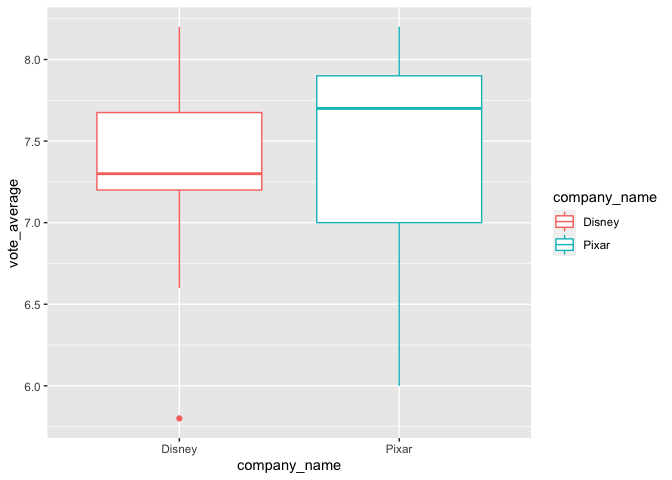
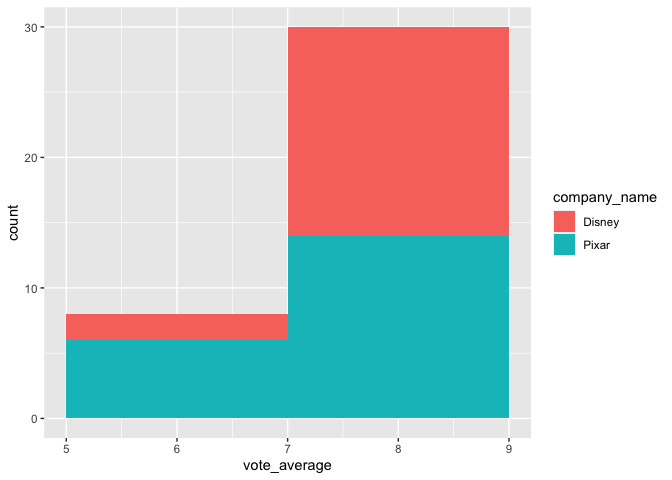

R Notebook
================

``` r
library(stringr)
library(httr)
library(purrr)
library(tidyr)
library(dplyr)
library(magrittr)
library(ggplot2)
library(knitr)
```

# Part 1

Getting access to “The Movie DB”

``` r
highest_gross_drama_2010 <-str_glue("https://api.themoviedb.org/3/",
                                    "discover/movie",
                                    "?api_key=55b3238346b11e88d118b5a647963747",
                                    "&with_genres=18&primary_release_year=2010&sort_by=revenue.desc") %>% 
  GET () %>% 
  content () %>%
  pluck("results") %>% 
  purrr::map_df(magrittr::extract,c ("title")) %>% 
  kable()

                             
actors_together<- str_glue("https://api.themoviedb.org/3/",
                           "discover/movie",
                           "?api_key=55b3238346b11e88d118b5a647963747",
                           "&with_cast=23659&with_cast=3896&sort_by=popularity.desc") %>% 
  GET() %>% 
  content() %>%
  pluck("results") %>% 
  #map(pluck,"title") %>% 
  purrr::map_df(magrittr::extract,c ("title")) %>% 
  kable()
  #map_df(extract, c("title"))  Not sure why map_df does not work

tom_cruise_kidsmovies<- str_glue("https://api.themoviedb.org/3/",
                                 "discover/movie",
                                 "?api_key=55b3238346b11e88d118b5a647963747",
                                 "&certification.lte=G&with_cast=500") %>% 
  GET() %>% 
  content() %>%
  pluck("results") %>%   
  purrr::map_df(magrittr::extract,c ("title")) %>% 
  kable() 
# map_df(extract, c("title"))
```

The highest grossing dramas from 2010 are :

| title                           |
| :------------------------------ |
| The Twilight Saga: Eclipse      |
| The King’s Speech               |
| The Karate Kid                  |
| Black Swan                      |
| Robin Hood                      |
| Shutter Island                  |
| Sex and the City 2              |
| True Grit                       |
| The Social Network              |
| Due Date                        |
| Eat Pray Love                   |
| Step Up 3D                      |
| The Town                        |
| The Bounty Hunter               |
| Wall Street: Money Never Sleeps |
| Dear John                       |
| Life As We Know It              |
| Hereafter                       |
| Love & Other Drugs              |
| Aftershock                      |

Movie with actors Ferrell and Liam Neeson are :

| title                                                          |
| :------------------------------------------------------------- |
| Star Wars: The Rise of Skywalker                               |
| Made in Italy                                                  |
| Batman Begins                                                  |
| The Dark Knight Rises                                          |
| Men in Black: International                                    |
| Ted 2                                                          |
| The Chronicles of Narnia: The Lion, the Witch and the Wardrobe |
| Taken 3                                                        |
| A Walk Among the Tombstones                                    |
| Schindler’s List                                               |
| Cold Pursuit                                                   |
| Taken                                                          |
| Clash of the Titans                                            |
| The Lego Movie                                                 |
| Battleship                                                     |
| The Commuter                                                   |
| After.Life                                                     |
| Star Wars: Episode I - The Phantom Menace                      |
| Star Wars: Episode II - Attack of the Clones                   |
| The Chronicles of Narnia: Prince Caspian                       |

The kids movie done by Tom cruise are :

| title                                |
| :----------------------------------- |
| Mission: Impossible - Ghost Protocol |
| Mission: Impossible - Fallout        |
| Mission: Impossible - Rogue Nation   |
| Edge of Tomorrow                     |
| Top Gun                              |
| Mission: Impossible III              |
| Oblivion                             |
| Collateral                           |
| Minority Report                      |
| War of the Worlds                    |
| Interview with the Vampire           |
| Legend                               |
| The Last Samurai                     |
| Mission: Impossible II               |
| Eyes Wide Shut                       |
| The Mummy                            |
| Mission: Impossible                  |
| Vanilla Sky                          |
| Rock of Ages                         |
| Austin Powers in Goldmember          |

# Part 2

Extract id of the Pixar company

``` r
Pixar <- str_glue(
  "https://api.themoviedb.org/3/",
  "search/company",
  "?api_key=55b3238346b11e88d118b5a647963747",
  "&query=Pixar&page=1"
) %>%
  GET %>%
  content %>%
  pluck("results") %>%
  purrr::map_df(magrittr::extract, c ("id", "name"))

Pixar_id_found<-Pixar %>% 
  filter(name=="Pixar") %>% 
  kable()
  

Pixar_revenue_movies <- str_glue(
  "https://api.themoviedb.org/3/",
  "discover/movie",
  "?api_key=55b3238346b11e88d118b5a647963747",
  "&sort_by=revenue.desc&include_adult=false&include_video=false&page=1&with_companies=3"
) %>%
  GET() %>%
  content() %>%
  pluck("results") %>%
  purrr::map_df(magrittr::extract, c ("original_title")) %>%
  kable() 
```

Pixar id was found to be

| id | name  |
| -: | :---- |
|  3 | Pixar |

.

Pixar movies sorted by descending revenue are :

| original\_title     |
| :------------------ |
| Incredibles 2       |
| Toy Story 4         |
| Toy Story 3         |
| Finding Dory        |
| Finding Nemo        |
| Inside Out          |
| Coco                |
| Monsters University |
| Up                  |
| The Incredibles     |
| Ratatouille         |
| Monsters, Inc.      |
| Cars 2              |
| Brave               |
| WALL·E              |
| Toy Story 2         |
| Cars                |
| Cars 3              |
| Toy Story           |
| A Bug’s Life        |

# Part 3

Pixar movies sorted by descending revenue

``` r
pages<-as.character(seq(1,6,1))

Pixar_revenue_movies_id <-str_glue("https://api.themoviedb.org/3/",
                                   "discover/movie",
                                   "?api_key=55b3238346b11e88d118b5a647963747",
                                   "&sort_by=revenue.desc&include_adult=false&include_video=false&page={pages}&with_companies=3") %>% 
  map(GET) %>% 
  map(content)%>%
  map(pluck, "results") %>% 
  flatten() %>% 
  map_df(magrittr::extract, c("original_title", "id")) %>% 
  kable()
```

Pixar movies sorted by descending revenue are :

| original\_title                                      |     id |
| :--------------------------------------------------- | -----: |
| Incredibles 2                                        | 260513 |
| Toy Story 4                                          | 301528 |
| Toy Story 3                                          |  10193 |
| Finding Dory                                         | 127380 |
| Finding Nemo                                         |     12 |
| Inside Out                                           | 150540 |
| Coco                                                 | 354912 |
| Monsters University                                  |  62211 |
| Up                                                   |  14160 |
| The Incredibles                                      |   9806 |
| Ratatouille                                          |   2062 |
| Monsters, Inc.                                       |    585 |
| Cars 2                                               |  49013 |
| Brave                                                |  62177 |
| WALL·E                                               |  10681 |
| Toy Story 2                                          |    863 |
| Cars                                                 |    920 |
| Cars 3                                               | 260514 |
| Toy Story                                            |    862 |
| A Bug’s Life                                         |   9487 |
| The Good Dinosaur                                    | 105864 |
| Onward                                               | 508439 |
| Knick Knack                                          |  13928 |
| Tin Toy                                              |  13927 |
| Untitled Pixar Animation Project (2)                 | 718789 |
| Out                                                  | 706860 |
| Forky Asks a Question: What is Reading?              | 662666 |
| Forky Asks a Question: What Is Cheese?               | 660867 |
| Forky Asks a Question: What Is a Pet?                | 660866 |
| Forky Asks a Question: What Is a Leader?             | 660862 |
| Forky Asks a Question: What Is a Computer?           | 660861 |
| Forky Asks a Question: What Is Love?                 | 660859 |
| Forky Asks a Question: What Is Time?                 | 660858 |
| Forky Asks a Question: What Is Art?                  | 660856 |
| Forky Asks a Question: What Is a Friend?             | 660855 |
| Forky Asks a Question: What Is Money?                | 660851 |
| Lamp Life                                            | 594530 |
| Float                                                | 574093 |
| Wind                                                 | 574091 |
| Loop                                                 | 574089 |
| Kitbull                                              | 574074 |
| It’s Tough to Be a Bug                               | 549863 |
| Auntie Edna                                          | 546728 |
| Purl                                                 | 532953 |
| Smash and Grab                                       | 532952 |
| Bao                                                  | 514754 |
| Untitled Pixar Animation Project (1)                 | 508947 |
| Luca                                                 | 508943 |
| Soul                                                 | 508442 |
| Miss Fritter’s Racing Skoool                         | 483396 |
| Luxo Jr. Pencil Test                                 | 478793 |
| The Story Behind ‘Toy Story’                         | 464729 |
| Dante’s Lunch                                        | 449621 |
| Lou                                                  | 433471 |
| Marine Life Interviews                               | 427004 |
| The Incredible Socks                                 | 416573 |
| Piper                                                | 399106 |
| Riley’s First Date?                                  | 355338 |
| Sanjay’s Super Team                                  | 345637 |
| Flags and Waves                                      | 300445 |
| Beach Chair                                          | 300247 |
| Exploring the Reef                                   | 296850 |
| Cars Toons: Tales from Radiator Springs - Bugged     | 296159 |
| Cars Toons: Tales from Radiator Springs - Spinning   | 296137 |
| Up and Down                                          | 287097 |
| Surprise                                             | 287096 |
| Light and Heavy                                      | 287095 |
| Lava                                                 | 286192 |
| The Radiator Springs 500½                            | 286189 |
| Party Central                                        | 258152 |
| Toy Story That Time Forgot                           | 256835 |
| Front and Back                                       | 246673 |
| Cars Toons: Tales from Radiator Springs - Hiccups    | 230767 |
| Toy Story of Terror\!                                | 213121 |
| Somewhere in the Arctic…                             | 209681 |
| Winter                                               | 209679 |
| Palm Springs                                         | 209676 |
| Next Door                                            | 209674 |
| Lady and the Lamp                                    | 208670 |
| Nitemare                                             | 208658 |
| The Blue Umbrella                                    | 200481 |
| Unidentified Flying Mater                            | 171536 |
| A Story                                              | 148950 |
| Moon Mater                                           | 148608 |
| Heavy Metal Mater                                    | 148607 |
| Mater Private Eye                                    | 148606 |
| Monster Truck Mater                                  | 148605 |
| Air Mater                                            | 145316 |
| Time Travel Mater                                    | 141528 |
| The Legend of Mor’du                                 | 141423 |
| Mater the Greater                                    | 140967 |
| La luna                                              |  83564 |
| Small Fry                                            |  82424 |
| Hawaiian Vacation                                    |  77887 |
| George & A.J.                                        |  72962 |
| Rescue Squad Mater                                   |  56553 |
| Mr. Incredible and Pals                              |  55423 |
| Day & Night                                          |  40619 |
| El Materdor                                          |  39030 |
| Dug’s Special Mission                                |  24589 |
| Partly Cloudy                                        |  24480 |
| Tokyo Mater                                          |  24328 |
| Buzz Lightyear of Star Command: The Adventure Begins |  16187 |
| Mater and the Ghostlight                             |  13934 |
| One Man Band                                         |  13933 |
| Jack-Jack Attack                                     |  13932 |
| Mike’s New Car                                       |  13931 |
| For the Birds                                        |  13930 |
| Geri’s Game                                          |  13929 |
| Red’s Dream                                          |  13926 |
| Luxo Jr.                                             |  13925 |
| The Adventures of André and Wally B.                 |  13924 |
| BURN·E                                               |  13413 |
| Boundin’                                             |  13062 |
| Your Friend the Rat                                  |  13061 |
| Lifted                                               |  13060 |
| Presto                                               |  13042 |

# Part 4

Comparison of the popularity of both Disney and Pixar films that came
out from 2006 onwards.

``` r
 # Part 4
 
Disney<- str_glue("https://api.themoviedb.org/3/",
                  "search/company",
                  "?api_key=55b3238346b11e88d118b5a647963747",
                  "&query=Disney&page=1") %>% 
  GET() %>% 
  content() %>%
  pluck("results") %>% 
  map_df(magrittr::extract, c("name", "id")) 

Disney_id_table<-Disney%>% 
  kable()

Disney_movies<- str_glue("https://api.themoviedb.org/3/",
                         "discover/movie",
                         "?api_key=55b3238346b11e88d118b5a647963747",
                         "&include_adult=false&include_video=false&page=1&primary_release_year=>%3D2006&with_companies=2") %>% 
  GET() %>% 
  content() %>%
  pluck("results") %>% 
  map_df(magrittr::extract, c("original_title","release_date","vote_average", "vote_count","popularity"))

Disney_movie_table<-Disney_movies %>% 
  kable()

Pixar_movies<- str_glue("https://api.themoviedb.org/3/",
                       "discover/movie",
                       "?api_key=55b3238346b11e88d118b5a647963747",
                       "&include_adult=false&include_video=false&page=1&primary_release_year=>%3D2006&with_companies=3") %>% 
                            GET %>% 
                            content %>%
                            pluck("results") %>% 
                            map_df(magrittr::extract, c("original_title","release_date","vote_average", "vote_count","popularity")) 

Pixar_movie_table<-Pixar_movies %>% 
  kable()

Pixar_filtered<-Pixar_movies %>%
                mutate(company_name="Pixar") %>% 
                filter(vote_count>=50)
Disney_filtered<-Disney_movies %>%
                mutate(company_name="Disney") %>% 
                filter(vote_count>=50)
Disney_Pixar<-bind_rows(Pixar_filtered,Disney_filtered)


Disney_Pixar %>%
  select(vote_average,popularity,company_name) %>% 
  ggplot2::ggplot(mapping = aes(x = company_name, y = vote_average, group=company_name)) +
  geom_boxplot(aes(colour=company_name))
```

<!-- -->

``` r
Disney_Pixar %>% 
  select(vote_average,popularity,company_name) %>%
  ggplot(mapping = aes(x = vote_average, fill = company_name)) +
  geom_histogram(binwidth = 2)
```

<!-- -->

``` r
Disney_Pixar %>% 
  select(vote_average,popularity,company_name) %>% 
  infer::t_test(vote_average ~ company_name,
         order = c("Pixar", "Disney")
         ,var.equal = FALSE)
```

    ## # A tibble: 1 x 6
    ##   statistic  t_df p_value alternative lower_ci upper_ci
    ##       <dbl> <dbl>   <dbl> <chr>          <dbl>    <dbl>
    ## 1     0.787  35.8   0.437 two.sided     -0.222    0.503

Searching for Disney id :

| name                        |     id |
| :-------------------------- | -----: |
| Disney                      | 134315 |
| Disney+                     | 134208 |
| Disney+                     | 134209 |
| Disney Latino               |  41452 |
| Disney Television Animation |   3475 |
| Walt Disney Animation       | 112779 |
| Disney Channel              | 126022 |
| Disney Enterprises          |  26151 |
| Disney Destinations         | 104966 |
| Disney Türkiye              |  99981 |
| Disney Einstein             |   4855 |
| Walt Disney Pictures        |      2 |
| Walt Disney Germany         |  88716 |
| Walt Disney Productions     | 113455 |
| Walt Disney Television      |    670 |
| Disney Interactive, Canada  |  41712 |
| Walt Disney Imagineering    |  15935 |
| Disney World Cinema         |  89347 |
| Walt Disney Pictures        | 135944 |
| Walt Disney Television      | 120254 |

Disney id (Walt Disney Pictures) was found to be 2.

vote averages and vote counts for Disney movies
:

| original\_title                                          | release\_date | vote\_average | vote\_count | popularity |
| :------------------------------------------------------- | :------------ | ------------: | ----------: | ---------: |
| Star Wars: The Rise of Skywalker                         | 2019-12-18    |           6.6 |        5496 |    138.002 |
| The One and Only Ivan                                    | 2020-08-21    |           7.2 |          71 |     81.278 |
| The Lion King                                            | 2019-07-12    |           7.2 |        6651 |    113.108 |
| Frozen II                                                | 2019-11-20    |           7.3 |        5885 |    123.726 |
| Onward                                                   | 2020-02-29    |           7.9 |        2958 |    112.161 |
| Frozen                                                   | 2013-11-27    |           7.3 |       12260 |     67.363 |
| Maleficent: Mistress of Evil                             | 2019-10-16    |           7.3 |        3497 |     90.697 |
| Inside Out                                               | 2015-06-09    |           7.9 |       15350 |     68.456 |
| Thor: Ragnarok                                           | 2017-10-25    |           7.6 |       14494 |     65.309 |
| Mulan                                                    | 2020-09-04    |           0.0 |           0 |     80.030 |
| Artemis Fowl                                             | 2020-06-12    |           5.8 |         760 |     92.849 |
| Aladdin                                                  | 2019-05-22    |           7.1 |        6709 |     81.130 |
| Toy Story 4                                              | 2019-06-19    |           7.6 |        5842 |     90.713 |
| Phineas and Ferb The Movie: Candace Against the Universe | 2020-08-28    |           6.4 |           6 |     64.414 |
| Black Panther                                            | 2018-02-13    |           7.4 |       15697 |     60.530 |
| Zootopia                                                 | 2016-02-11    |           7.7 |       12089 |     65.292 |
| Coco                                                     | 2017-10-27    |           8.2 |       11982 |     61.408 |
| Monsters, Inc.                                           | 2001-11-01    |           7.8 |       13112 |     53.999 |
| Ralph Breaks the Internet                                | 2018-11-20    |           7.2 |        4810 |     68.422 |
| Maleficent                                               | 2014-05-28    |           7.1 |       10215 |     61.282 |

vote averages and vote counts for Pixar movies
:

| original\_title   | release\_date | vote\_average | vote\_count | popularity |
| :---------------- | :------------ | ------------: | ----------: | ---------: |
| Onward            | 2020-02-29    |           7.9 |        2958 |    112.161 |
| Inside Out        | 2015-06-09    |           7.9 |       15350 |     68.456 |
| Toy Story 4       | 2019-06-19    |           7.6 |        5842 |     90.713 |
| Coco              | 2017-10-27    |           8.2 |       11982 |     61.408 |
| Monsters, Inc.    | 2001-11-01    |           7.8 |       13112 |     53.999 |
| Incredibles 2     | 2018-06-14    |           7.6 |        9001 |     71.495 |
| Brave             | 2012-06-21    |           7.0 |        9932 |     51.287 |
| Toy Story         | 1995-10-30    |           7.9 |       12828 |     53.394 |
| Up                | 2009-05-28    |           7.9 |       14702 |     45.867 |
| Cars 3            | 2017-06-15    |           6.8 |        3502 |     46.164 |
| The Incredibles   | 2004-11-05    |           7.7 |       12892 |     40.089 |
| Finding Nemo      | 2003-05-30    |           7.8 |       13927 |     41.400 |
| Toy Story 3       | 2010-06-16    |           7.8 |       10580 |     45.600 |
| Ratatouille       | 2007-06-22    |           7.7 |       11406 |     42.216 |
| Toy Story 2       | 1999-10-30    |           7.5 |        9641 |     42.187 |
| WALL·E            | 2008-06-22    |           8.0 |       13278 |     49.956 |
| A Bug’s Life      | 1998-11-25    |           6.9 |        6347 |     34.486 |
| Cars 2            | 2011-06-11    |           6.0 |        5103 |     40.895 |
| The Good Dinosaur | 2015-11-14    |           6.7 |        3896 |     43.418 |
| Finding Dory      | 2016-06-16    |           7.0 |        9204 |     28.014 |

Using the box plot, it looks **vote\_average** is comparable for this
set of movies (from year 2006) from Pixar and Disney.

Here p-value is greater than 0.05 which means there is not a strong
relationship between the variables **vote\_average** and
**company\_name** of movies (from year 2006) from Pixar and Disney.
